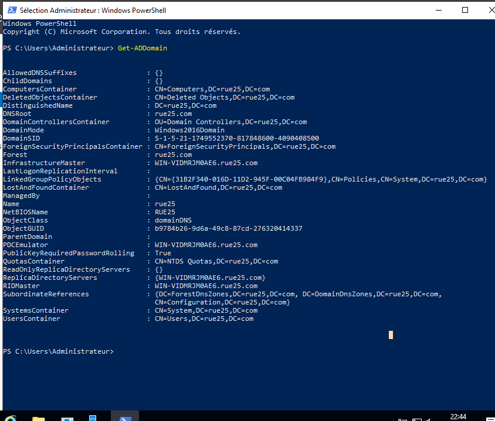
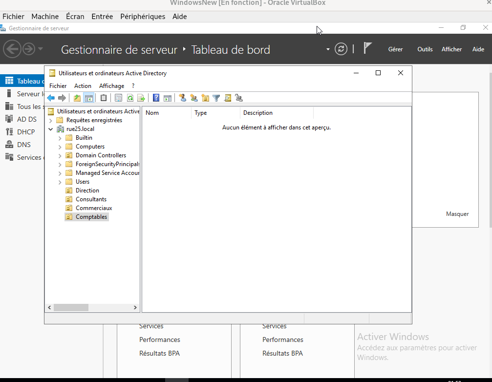
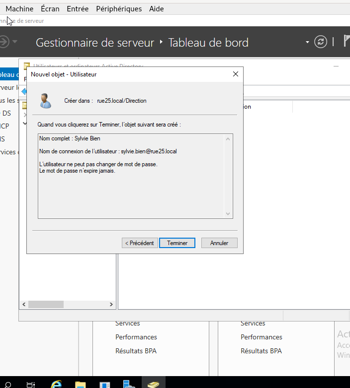
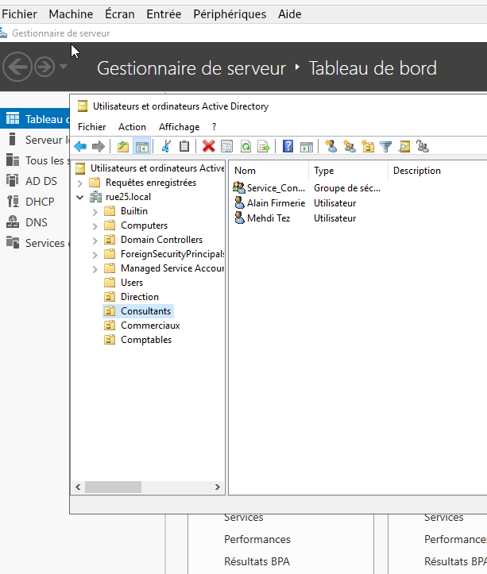
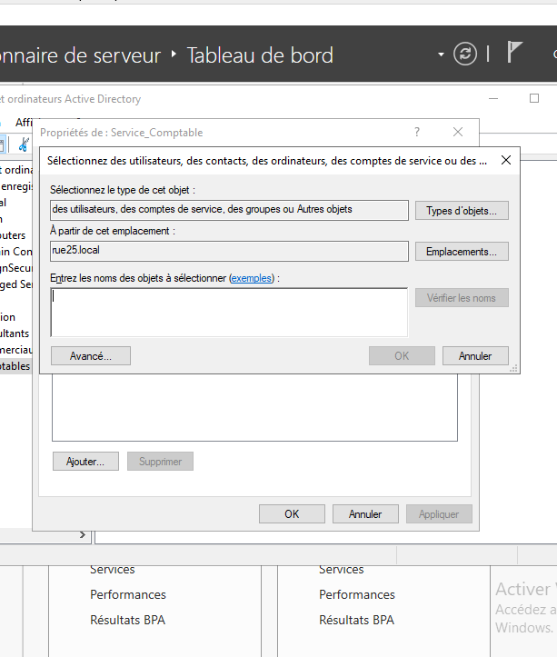

# Installation AD DS (Active Directory) + création OU / groupes / utilisateurs

Après avoir configuré l’IP statique, je vais dans le **Gestionnaire de serveur** puis :
**Ajouter des rôles et des fonctionnalités**.

Je sélectionne :
- Installation basée sur un rôle ou une fonctionnalité
- Le serveur (dans le pool)
Puis je coche :
- **Active Directory Domain Services (AD DS)**

Je clique sur suivant jusqu’à lancer l’installation. :contentReference[oaicite:4]{index=4}

👉 Capture d’écran à insérer ici : ajout du rôle AD DS dans le Gestionnaire de serveur

## Promotion en contrôleur de domaine
Après l’installation, il y a un drapeau jaune en haut à droite (configuration nécessaire).  
Je clique sur **Promouvoir ce serveur en contrôleur de domaine**.

Je choisis :
- **Ajouter une nouvelle forêt**
- Nom de domaine : **rue25.local**
Puis je configure le mot de passe et je redémarre. :contentReference[oaicite:5]{index=5}

👉 Capture d’écran à insérer ici : étape "Promouvoir ce serveur…"

## Vérification du domaine
Après redémarrage, je vérifie que le domaine est bien en place.

---

## Création des unités d’organisation (OU)
Ensuite, je configure Active Directory en créant les unités organisationnelles correspondant aux services :
- Direction
- Commercial
- Comptabilité
- Immobilier

Je vais dans :
Outils → **Utilisateurs et ordinateurs Active Directory**  
Puis clic droit sur le domaine → Nouveau → **Unité d’organisation**. :contentReference[oaicite:6]{index=6}

---

## Création des groupes de sécurité
Pour chaque OU, je crée un groupe de sécurité (ça sert à gérer les permissions plus facilement, surtout pour les partages).  
Dans l’OU : clic droit → Nouveau → **Groupe**.

👉 Capture d’écran à insérer ici : création d’un groupe de sécurité (nom du groupe + type sécurité)

---

## Création des utilisateurs
Dans chaque OU, je crée ensuite les comptes utilisateurs :
clic droit → Nouveau → **Utilisateur**.

Après création, je vérifie qu’il est bien placé dans la bonne OU :

---

## Ajout de l’utilisateur dans le groupe
Ensuite j’ajoute chaque utilisateur dans le groupe correspondant à son service (important pour les droits sur les dossiers partagés).

