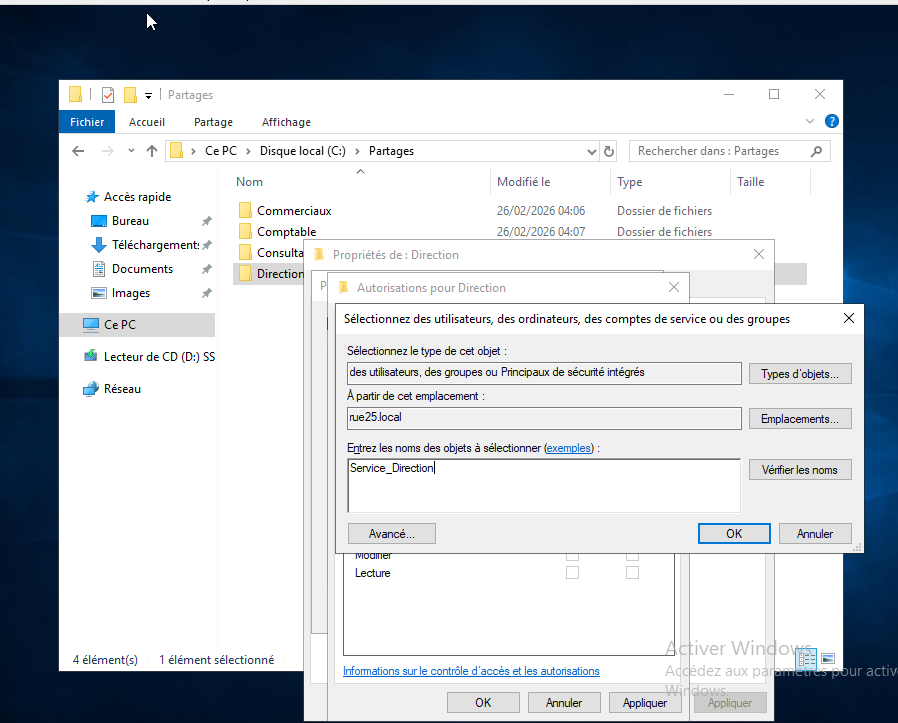
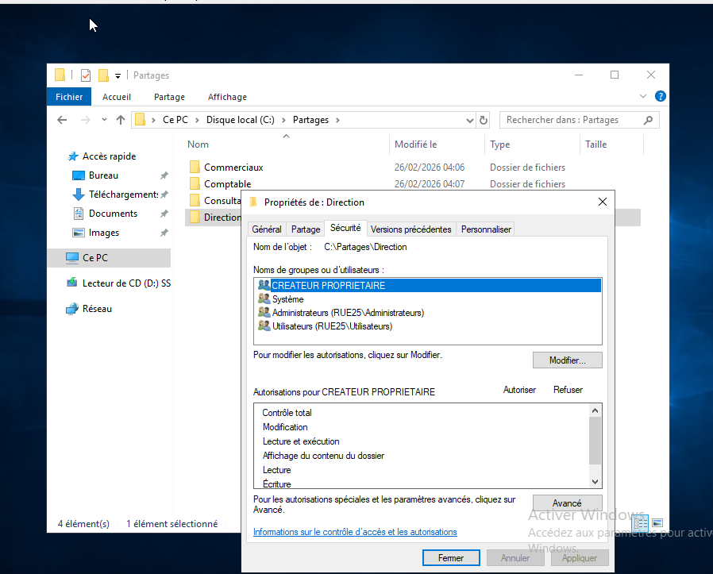

# Partage de fichiers (dossiers partagés + permissions)

Pour faire un dossier partagé, je vais dans l’explorateur de fichiers.
Je crée sur le disque dur un dossier principal qui s’appelle **Partage**, puis dedans je crée des dossiers correspondant à chaque unité d’organisation (service).  
Exemple : Direction, Commercial, Comptabilité, Immobilier.

---

## Partage avancé
Je fais clic droit sur le dossier (ex : Comptabilité) → Propriétés → onglet **Partage** → **Partage avancé**.

Je coche :
- **Partager ce dossier**

Ensuite je vais dans **Autorisations** (Permissions si Windows est en anglais).  
Là, je supprime **Tout le monde (Everyone)** parce que je ne veux pas que n’importe qui ait accès.

Puis je fais **Ajouter** et je rentre le **nom du groupe** (et pas le nom de l’OU).  
Exemple : groupe "Service Comptable".  
Je clique sur **Vérifier les noms** : si c’est bon, le nom se souligne. Sinon ça veut dire que j’ai fait une faute ou que le groupe n’existe pas.

Ensuite j’attribue les droits (lecture / écriture / modification selon le besoin).  
Souvent je mets **Contrôle total** au groupe du service pour le dossier de son service.

---

## Permissions NTFS (Sécurité)
Après le partage, je vais aussi dans l’onglet **Sécurité** (permissions NTFS).  
Je clique sur **Modifier** → **Ajouter** → je remets le **groupe** du service → Vérifier les noms.  
Puis je donne au groupe les droits nécessaires (lecture, écriture, modification).

👉 Capture d’écran à insérer ici : onglet Sécurité (NTFS) avec le groupe + droits
