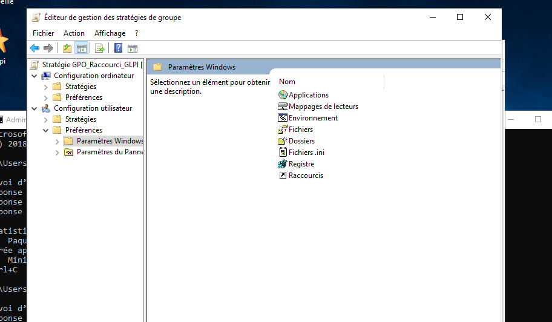

# GPO (Stratégies de groupe)

Les GPO, ça permet aux administrateurs de configurer et contrôler automatiquement les ordinateurs et les utilisateurs.  
Par exemple :
- imposer un mot de passe complexe
- bloquer certaines actions (accès paramètres, panneau de configuration…)
- mettre un fond d’écran
- appliquer des paramètres de sécurité automatiquement

## Création d’une GPO
Je tape dans la recherche Windows Server : **Gestion de stratégie de groupe** (Group Policy Management).

Je vais dans :
Forêt → domaine **rue25.local** → et je repère **Objets de stratégie de groupe**.

Je fais clic droit → **Nouveau** et je crée une GPO.  
Exemple de nom : `GPO-GLPI` (ou un nom clair selon le but).

## Modification de la GPO
Je fais clic droit sur la GPO → **Modifier**.  
Une fenêtre “Éditeur de gestion de stratégie de groupe” s’ouvre.

Je peux ensuite aller dans :
Configuration ordinateur → Stratégies → Paramètres Windows → Paramètres de sécurité  
Puis je cherche les options selon ce que je veux bloquer/autoriser (options de sécurité, ouverture de session, etc.).

## Liaison de la GPO
Pour qu’elle s’applique, je la lie au domaine ou à une OU (selon ce que je veux).  
Exemple : si je veux que ça touche juste Comptabilité, je lie la GPO à l’OU Comptabilité.

