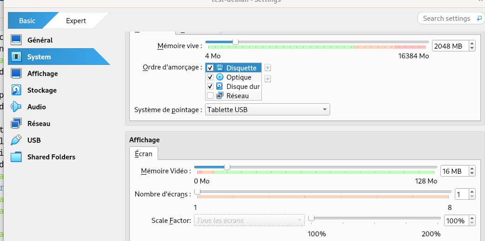

## Création de la machine virtuelle Debian

Dans le cadre de l’installation du parc informatique de l’agence **Rue25**, nous avons décidé d’utiliser **GLPI** comme outil de gestion du parc informatique et des demandes de support technique.

GLPI étant une application web open source, nous avons fait le choix de l’installer sur une **machine virtuelle Debian 11.6 sans interface graphique**, afin d’avoir un serveur léger et administré uniquement en ligne de commande.

La machine virtuelle Debian a été créée en respectant les configurations demandées :
- CPU : 1
- RAM : 2 Go
- Stockage : 20 Go

Une fois la machine virtuelle créée, j’ai lancé l’installation de Debian et j’ai suivi les étapes jusqu’à obtenir un système fonctionnel en mode terminal.

