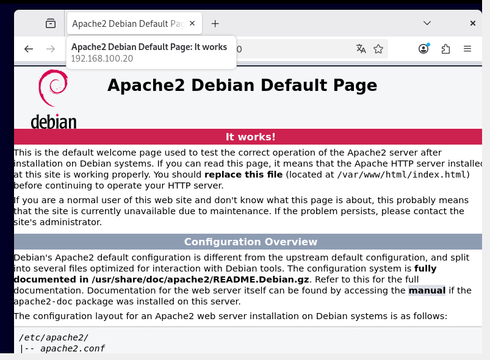

## Installation des dépendances nécessaires à GLPI

GLPI est une application web. Pour fonctionner correctement, elle a besoin d’un serveur web, d’une base de données et du langage PHP.

Je commence par installer Apache, qui servira de serveur web.

Commande utilisée :
apt install apache2

Afin de stocker les utilisateurs, les tickets et la configuration de GLPI, une base de données est nécessaire. J’installe donc MariaDB, qui est un équivalent de MySQL.

Commande utilisée :
apt install mariadb-server

GLPI utilise PHP. J’installe donc PHP ainsi que les modules nécessaires à son bon fonctionnement, notamment pour la base de données et la liaison LDAP.

Commande utilisée :
apt install php php-mysql php-xml php-ldap

Pour vérifier que le serveur web fonctionne correctement, je me rends dans un navigateur et je tape l’adresse IP de la machine Debian.  
La page par défaut d’Apache s’affiche, ce qui confirme que le serveur web fonctionne.

