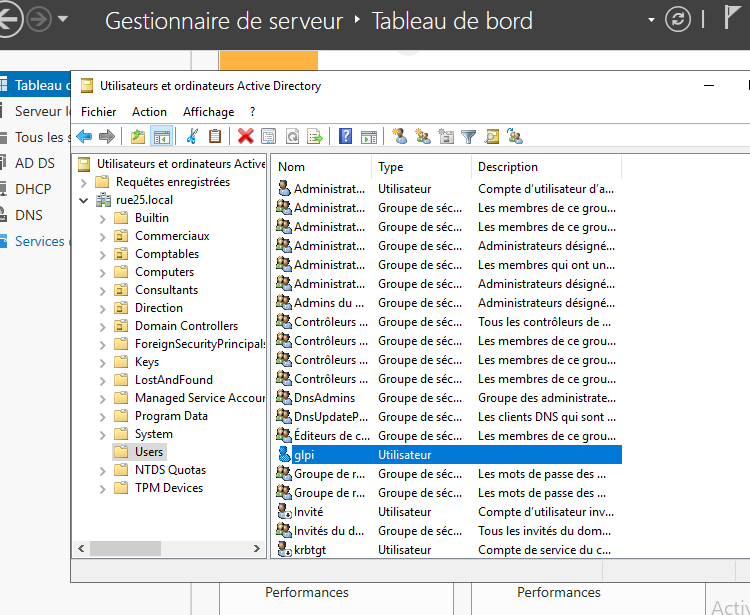

## Configuration initiale de GLPI via l’interface web

Une fois Apache redémarré, je me rends dans un navigateur web et je tape l’adresse suivante :
http://adresse_IP_de_la_machine/glpi

La page d’installation de GLPI s’affiche.  
Je suis alors le guide d’installation et je renseigne les informations demandées, notamment celles de la base de données créée précédemment afin que GLPI puisse s’y connecter.

GLPI crée automatiquement les tables nécessaires.

À la fin de l’installation, des identifiants par défaut sont fournis.  
Je les utilise pour me connecter à l’interface afin de vérifier que l’installation est bien fonctionnelle.
je créé ensuite sur ma machine windows server dans mon domain rue25.local et dans le dossier users par defaut un utilisateur nommé glpi qui nous servira a lier glpi et l'AD

