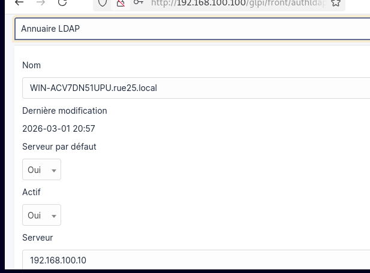
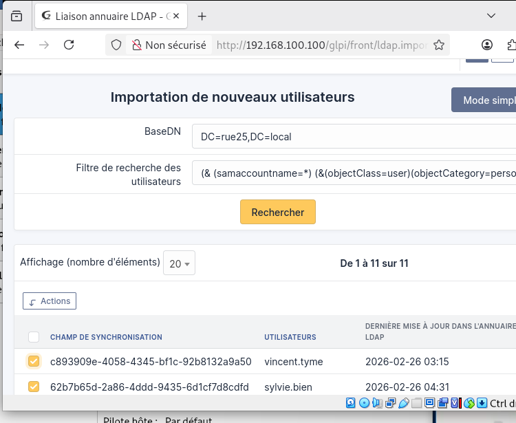

## Liaison entre GLPI et Active Directory (LDAP)

Dans un petit environnement, il serait possible d’utiliser GLPI uniquement en local en créant les comptes manuellement.  
Cependant, dans le cadre de l’infrastructure mise en place pour l’agence Rue25, cette solution ne serait pas pratique.

L’objectif est de permettre aux utilisateurs de se connecter à GLPI avec leur compte Active Directory, en utilisant leurs identifiants de l’entreprise.

Cette liaison se fait grâce au protocole LDAP, qui permet à GLPI d’interroger l’Active Directory, d’importer les utilisateurs et d’authentifier les connexions.

Je me connecte à GLPI avec un compte administrateur, puis je me rends dans le menu :
Configuration → Authentification.

Si la dépendance php-ldap est bien installée, l’option Annuaire LDAP apparaît.  
Je clique sur le bouton + et je renseigne les informations de l’Active Directory.

Je lance ensuite les tests.  
Si le message connexion réussie apparaît, cela signifie que la liaison fonctionne correctement.

Pour importer les utilisateurs, je me rends dans :
Administration → Utilisateurs → Annuaires LDAP, puis je lance l’importation.

Cette configuration permet aux utilisateurs de se connecter à GLPI avec leurs identifiants Active Directory, sans créer de comptes manuellement.

