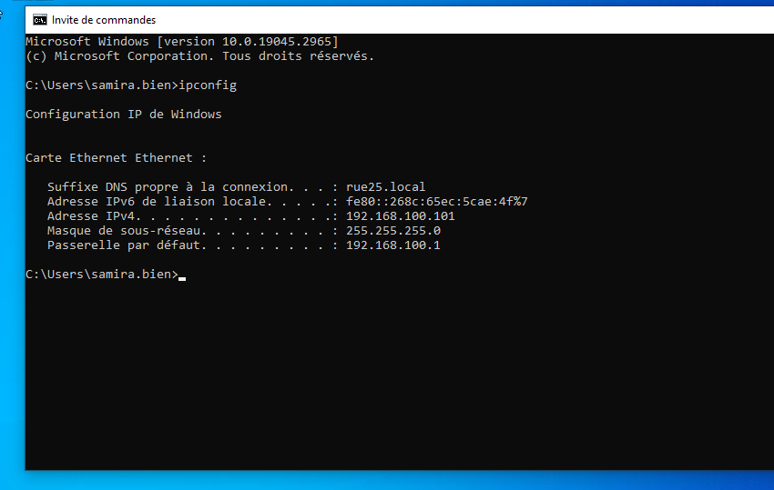
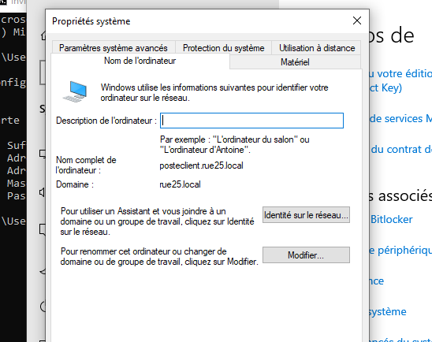

## Test de la configuration sur un poste client Windows

Une fois toute la configuration du serveur Windows terminée, j’ai réalisé des tests sur un poste client afin de vérifier que l’infrastructure fonctionne correctement.

Quand je parle de configuration complète, cela comprend :
- le serveur Windows Server configuré
- Active Directory opérationnel
- DNS fonctionnel
- DHCP opérationnel (déjà testé sur une machine Debian)
- les groupes, utilisateurs et GPO déjà en place

Pour ce test, j’ai créé une nouvelle machine virtuelle avec **Windows 10**, à partir de l’ISO officiel.

## Test du DHCP sur le poste client

Le poste client Windows n’ayant encore jamais été testé avec le DHCP, je commence par vérifier que le serveur DHCP lui attribue bien une adresse IP automatiquement.

Une fois Windows installé, je vérifie la configuration réseau.  
Si le poste reçoit une adresse IP faisant partie du réseau configuré sur le serveur DHCP, alors le service fonctionne correctement.

Si tout est bon à ce niveau-là, je peux continuer les tests.

## Intégration du poste client au domaine

Une fois le DHCP validé, je passe à l’intégration du poste client au domaine.

Je vais dans l’explorateur de fichiers, je fais un clic droit sur **Ce PC**, puis je me rends dans :
- Propriétés
- Paramètres avancés du système
- Nom de l’ordinateur

Je clique ensuite sur **Modifier** afin de joindre le poste au domaine.

Je coche **Domaine** et j’entre exactement le nom du domaine que nous avons créé :
rue25.local

Le système me demande alors les identifiants d’un compte administrateur du domaine.  
Une fois les informations renseignées, le poste redémarre automatiquement.

Si tout se passe bien, cela signifie que le poste client a bien rejoint le domaine Active Directory.

