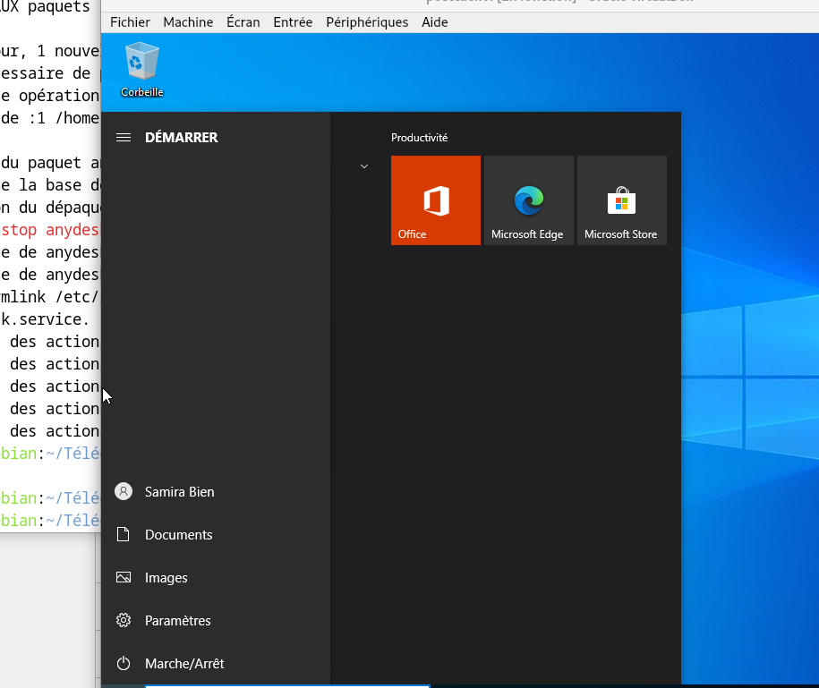

## Test de connexion avec les utilisateurs Active Directory

Après l’intégration du poste client au domaine, je procède aux tests de connexion avec les utilisateurs créés dans l’Active Directory.

L’objectif est de vérifier que :
- les comptes AD fonctionnent
- les GPO sont bien appliquées
- les règles de sécurité sont respectées

## Test avec le compte de la directrice

Je commence par tester la connexion avec le compte de la directrice, nommé **Samira**, que nous avons créé précédemment dans l’Active Directory.

Je me connecte sur le poste client avec son identifiant et son mot de passe par défaut.

Lors de la configuration des GPO, nous avons imposé le changement de mot de passe lors de la première connexion.  
Au moment de la connexion, le système me demande donc de définir un nouveau mot de passe.

Je change le mot de passe et, si tout se passe bien, la session s’ouvre correctement.

Cela confirme que :
- le compte fonctionne
- la GPO est bien appliquée
- l’authentification via Active Directory est opérationnelle

## Tests avec les autres utilisateurs

Je réalise ensuite des tests avec les autres utilisateurs créés dans l’Active Directory, en fonction des groupes auxquels ils appartiennent.

Ces tests permettent de vérifier que :
- chaque utilisateur peut se connecter
- les accès correspondent bien aux droits définis
- les paramètres de base sont correctement appliqués

À ce stade, l’infrastructure est fonctionnelle et les tests de connexion confirment le bon fonctionnement du domaine et des postes clients.

Les éventuels problèmes rencontrés lors de ces tests seront détaillés dans une partie dédiée aux erreurs rencontrées.

