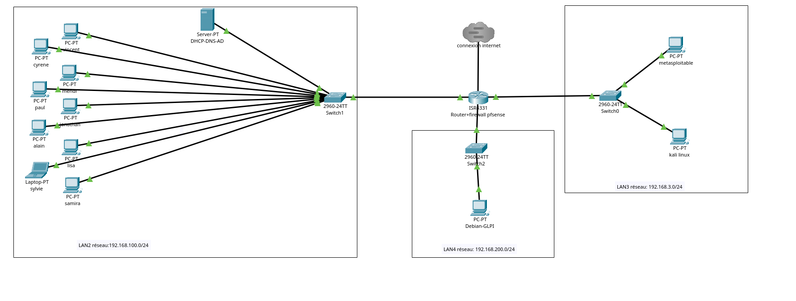

# Infrastructure Active Directory & GLPI – Simulation d’un réseau d’entreprise sécurisé

## Présentation

Ce projet met en place une infrastructure virtualisée reproduisant le fonctionnement d’un réseau d’entreprise structuré, segmenté et administré dans une logique de sécurisation.

L’environnement comprend :

- Un serveur Windows Server assurant les rôles Active Directory, DNS et DHCP
- Un serveur Debian hébergeant GLPI
- Un réseau utilisateurs avec plusieurs postes clients intégrés au domaine
- Un réseau dédié aux services
- Un réseau isolé pour les tests de sécurité
- Un accès Internet simulé via un équipement central de routage et de filtrage

L’objectif est de simuler une PME avec authentification centralisée, gestion des accès, segmentation réseau, déploiement de services internes, gestion des tickets et premières briques de cybersécurité.

---

## Architecture réseau

L’infrastructure est organisée autour de plusieurs segments réseau distincts :

- **LAN2** – Utilisateurs – 192.168.100.0/24  
  Ce réseau regroupe les postes clients du domaine ainsi que le serveur Windows Server assurant les rôles AD DS, DNS et DHCP.

- **LAN4** – Services – 192.168.200.0/24  
  Ce réseau est dédié au serveur Debian hébergeant GLPI.

- **LAN3** – Sécurité / Tests – 192.168.3.0/24  
  Ce réseau isolé regroupe les machines utilisées pour les tests de sécurité, notamment Kali Linux et Metasploitable.

- Accès externe / Internet  
  L’infrastructure est reliée à une connexion Internet simulée via un équipement central jouant le rôle de routeur / pare-feu.(en cours de configuration)

Le serveur DHCP installé sur le serveur Windows distribue des adresses IP sur le LAN2 ainsi que sur le LAN3, afin de montrer que l’attribution d’adresses peut également fonctionner sur plusieurs segments réseau via l’équipement de routage.

Cette architecture permet :

- D’isoler les différents usages par zone réseau
- De mieux contrôler les flux entre les segments
- De séparer les postes utilisateurs, les services internes et l’environnement de test
- De rendre le lab plus réaliste dans une logique d’administration d’infrastructure sécurisée

---

## Organisation de l’entreprise

L’entreprise est structurée en plusieurs pôles :

- Direction
- Commerciaux
- Consultants
- Comptables

Chaque pôle dispose :

- De ses propres utilisateurs
- D’un groupe de sécurité dédié
- De droits spécifiques sur les ressources partagées

Les permissions sont attribuées aux groupes, et les utilisateurs héritent des droits selon leur appartenance.  
Cette organisation permet de reproduire une gestion réaliste des accès dans un environnement d’entreprise.

---

## Active Directory et gestion des accès

Le serveur Windows Server joue le rôle de contrôleur de domaine.

Il assure les fonctions suivantes :

- Authentification centralisée des utilisateurs
- Gestion des unités d’organisation (OU)
- Gestion des groupes de sécurité
- Application de stratégies de groupe (GPO)
- Résolution de noms via DNS
- Attribution des adresses IP via DHCP

Les postes clients du réseau utilisateurs sont intégrés au domaine et peuvent se connecter avec des comptes personnels créés selon leur service.

Une GPO a été mise en place afin de déployer automatiquement un raccourci vers GLPI sur les postes clients.  
Cela permet aux utilisateurs d’accéder plus facilement à l’outil de ticketing depuis leur environnement de travail.

---

## GLPI et gestion des tickets

Le serveur Debian héberge GLPI sur un réseau dédié aux services.

GLPI est lié à l’Active Directory via LDAP, ce qui permet aux utilisateurs de se connecter avec leurs identifiants de domaine sans avoir à créer manuellement chaque compte dans l’application.

Les utilisateurs peuvent ainsi :

- Se connecter à GLPI avec leur compte Active Directory
- Créer des tickets
- Simuler des incidents ou des demandes
- Gérer et suivre les tickets selon leurs droits

Cette intégration permet de reproduire un environnement d’entreprise avec gestion centralisée des identités, support informatique et administration des accès.

---

## Fonctionnement du lab

Depuis les postes clients du réseau utilisateurs, il est possible de :

- Se connecter au domaine Active Directory
- Utiliser des identifiants personnels selon le service
- Accéder aux ressources autorisées selon les groupes
- Utiliser l’outil GLPI pour déclarer ou suivre des incidents

L’authentification est centralisée par Active Directory, tandis que les accès aux ressources et aux applications sont organisés selon les groupes et les politiques mises en place dans le domaine.

Ce lab reproduit ainsi un environnement cohérent mêlant :

- Administration système
- Services réseau
- Gestion des identités
- Support utilisateur
- Documentation et segmentation d’infrastructure

---

## Sécurité et tests réseau

Le projet intègre également une dimension orientée cybersécurité grâce à un réseau dédié aux tests.

Le réseau LAN3 permet d’isoler un environnement composé de Kali Linux et Metasploitable, utilisé pour réaliser des vérifications contrôlées dans le cadre du lab.

La machine Kali Linux permet de réaliser des scans réseau contrôlés sur les différents segments de l’infrastructure afin d’identifier :

- Les hôtes actifs
- Les ports ouverts
- Les services exposés
- La visibilité des machines selon leur segment réseau

Cette partie du lab permet d’introduire une logique de reconnaissance réseau, d’analyse de surface d’exposition et de sensibilisation à la sécurité dans un environnement isolé et maîtrisé.

---

## Compétences mises en œuvre

Ce projet permet de mobiliser plusieurs compétences techniques liées à l’administration d’infrastructures :

- Installation et configuration d’un serveur Windows
- Mise en place d’Active Directory
- Configuration DNS et DHCP
- Gestion des utilisateurs, groupes et OU
- Mise en place de GPO
- Intégration d’un poste client au domaine
- Installation et configuration d’un serveur Debian
- Déploiement de GLPI
- Liaison GLPI / Active Directory via LDAP
- Segmentation réseau
- Routage entre plusieurs segments
- Mise en place d’un environnement de test sécurité
- Réalisation de scans réseau contrôlés
- Documentation technique de l’infrastructure

---

## Évolution du projet

Le projet a évolué d’un environnement simple vers une infrastructure plus complète et plus réaliste, avec plusieurs segments réseau, une meilleure séparation des rôles et une première approche orientée cybersécurité.

Les prochaines évolutions pourront inclure :

- Un durcissement plus poussé des stratégies de sécurité
- Une supervision plus complète de l’infrastructure
- Des règles de filtrage plus avancées
- Une documentation détaillée des flux réseau
- Un enrichissement des scénarios de tests et d’administration

---

## Objectif du lab

Ce lab a pour objectif de démontrer une montée en compétence progressive sur des sujets liés à :

- L’administration systèmes et réseaux
- La gestion d’une infrastructure Windows / Linux
- La centralisation des services d’authentification
- L’organisation des accès dans un environnement professionnel
- La sécurisation et la segmentation d’un système d’information

Il s’inscrit dans une démarche d’apprentissage pratique, de documentation technique et de préparation à des missions d’administration d’infrastructures sécurisées.
