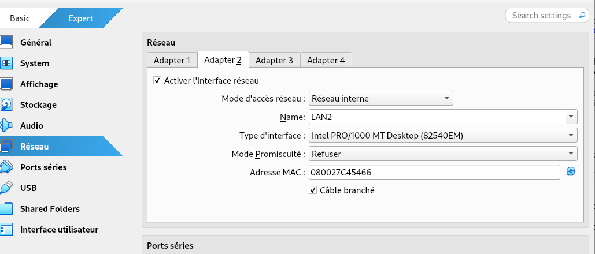
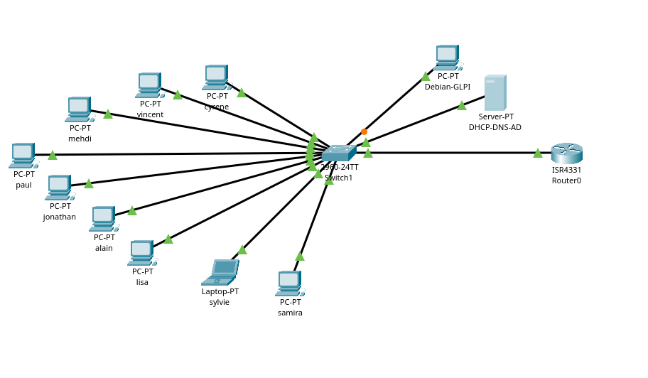

# Infrastructure Active Directory & GLPI – Simulation d’un réseau d’entreprise

## Présentation

Ce projet met en place une infrastructure virtualisée reproduisant le fonctionnement d’un réseau d’entreprise structuré.

L’environnement comprend :

- Un Windows Server (Active Directory, DNS, DHCP)
- Un serveur Debian hébergeant GLPI
- Un poste client Windows 10 joint au domaine
- Neuf utilisateurs répartis par services

L’objectif est de simuler une PME avec authentification centralisée, gestion des accès par service et gestion des tickets.

---

## Architecture réseau

Toutes les machines virtuelles sont connectées à la même interface réseau interne :

**LAN2**

Ce réseau interne permet :

- La communication entre toutes les machines
- L’attribution automatique des adresses IP via le DHCP du serveur Windows
- Une simulation réaliste d’un réseau d’entreprise isolé

---

## Organisation de l’entreprise

L’entreprise est structurée en plusieurs pôles :

- Direction  
- Commerciaux  
- Consultants  
- Comptables  

Chaque pôle dispose :

- De ses propres utilisateurs
- D’un groupe de sécurité dédié
- De droits spécifiques sur les ressources partagées

Les permissions sont attribuées aux groupes, et les utilisateurs héritent des droits selon leur appartenance.

---

## Fonctionnement du lab

Depuis le poste client Windows 10, il est possible de :

- Se connecter avec les neuf utilisateurs du domaine
- Utiliser leurs identifiants personnels
- Accéder aux ressources selon leur service

L’authentification est centralisée par Active Directory.

Une GPO a été mise en place afin de déployer automatiquement un raccourci vers GLPI sur les postes clients.  
Cela permet aux utilisateurs d’accéder à l’outil de ticketing sans avoir à saisir manuellement l’adresse IP du serveur Debian.

---

## Gestion des tickets

Le serveur Debian héberge GLPI, accessible depuis le réseau interne LAN2.

Les utilisateurs peuvent :

- Se connecter à GLPI
- Créer des tickets
- Simuler des incidents ou des demandes
- Gérer et suivre les tickets selon leurs droits

Ce lab reproduit ainsi un environnement d’entreprise complet avec gestion des identités, contrôle des accès et support informatique centralisé.

---

## Évolutions prévues

Le projet sera étendu avec les éléments suivants :

- Mise en place d’un système cloud pour simuler un stockage ou service externe
- Déploiement d’un pare-feu afin de renforcer la sécurité du réseau interne
- Ajout d’une machine Kali Linux destinée à réaliser des tests d’intrusion basiques sur le poste client (attaques simples et contrôlées)
- Renforcement progressif des stratégies de groupe (GPO) pour sécuriser davantage l’environnement

Ces ajouts permettront d’élargir le projet vers une approche plus orientée cybersécurité et sécurisation d’infrastructure.
