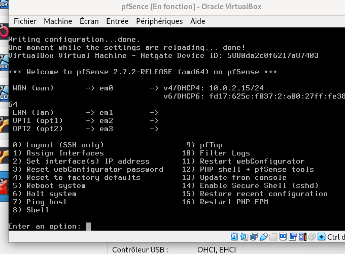

# Mise en place de pfSense et segmentation du réseau

À ce stade, l’architecture réseau est déjà bien avancée.  
On a déjà une machine Windows Server, une machine cliente Windows, un serveur Debian avec GLPI, et une machine Kali Linux. Jusqu’ici, plusieurs machines étaient sur le même réseau, ce qui fonctionnait pour les premiers tests, mais ce n’était pas très représentatif d’une vraie infrastructure d’entreprise.

L’objectif ici est donc d’ajouter une nouvelle machine virtuelle qui servira à la fois de pare-feu et de routeur : pfSense.  
Le pare-feu va permettre de contrôler les flux entre les réseaux, et le routeur va permettre de faire transiter les paquets d’un réseau à l’autre. Cela permet de segmenter l’infrastructure, de mieux isoler les machines, et de préparer la suite du projet, notamment l’intégration de Kali Linux pour réaliser des tests d’intrusion dans un cadre plus réaliste.

## Installation de la machine pfSense

Pour installer pfSense, je commence par récupérer l’ISO sur Internet.  
Je crée ensuite la machine virtuelle dans VirtualBox, comme pour les autres VM déjà créées auparavant. Comme on a déjà répété cette étape plusieurs fois, je ne détaille pas toute la création de la VM, puis je lance simplement l’installation graphique jusqu’à la fin.

Une fois l’installation terminée, je n’utilise pas tout de suite pfSense. Avant de démarrer réellement la configuration, je vais d’abord définir les cartes réseau de la machine dans les paramètres de VirtualBox.

## Configuration des interfaces réseau

Je configure plusieurs interfaces sur pfSense afin qu’il puisse jouer son rôle entre les différents réseaux.

Je mets :
- une interface NAT pour l’accès Internet
- une interface LAN2 pour le réseau où se trouvent Windows Server et le poste client
- une interface LAN3 pour le réseau où se trouve Kali Linux
- une interface LAN4 pour le nouveau réseau qui accueillera ensuite Debian / GLPI

Cela permet d’avoir une architecture plus propre, avec plusieurs sous-réseaux séparés.

Une fois la machine démarrée, je passe par le menu console de pfSense.  
J’utilise l’option 1 pour assigner les interfaces réseau aux bonnes cartes, puis l’option 2 pour leur attribuer les bonnes adresses IP.

Je définis ainsi les passerelles de chaque réseau afin que pfSense puisse devenir le point de passage entre eux.

## Premier accès à l’interface web

Une fois les interfaces configurées, je passe à la configuration via l’interface web.  
Pour cela, je choisis de me connecter d’abord depuis le réseau LAN3, car c’est celui qui était le plus simple à utiliser à ce moment-là pour accéder à pfSense.

Avant d’ouvrir le navigateur, je vérifie sur la machine du réseau LAN3 que l’adressage est correct :
- adresse IP dans le réseau 192.168.3.0
- passerelle en 192.168.3.1
- connectivité correcte avec la passerelle

Je teste cela avec un ping vers la passerelle.

Si tout fonctionne, j’ouvre ensuite le navigateur et je tape l’adresse de la passerelle en HTTPS.  
J’arrive alors sur la page de connexion de pfSense. Les identifiants par défaut utilisés sont :
- utilisateur : admin
- mot de passe : pfsense

Après la première connexion, pfSense recommande de changer le mot de passe d’administration. Je le modifie donc rapidement pour éviter de laisser les identifiants par défaut.

## Activation de l’accès depuis les autres réseaux

À ce moment-là, on arrive bien à joindre pfSense depuis un réseau, mais on n’a pas encore accès correctement depuis les autres interfaces.  
Je renomme donc les interfaces optionnelles avec les bons noms, puis j’ajoute les règles nécessaires dans Firewall > Rules afin d’autoriser les communications depuis les réseaux LAN2 et LAN4.

Pour chaque interface, je crée une règle autorisant :
- source : le subnet du réseau concerné
- destination : any

Je sauvegarde ensuite la règle et je fais la même chose sur l’autre interface.

## Vérification de la communication entre réseaux

Une fois les règles appliquées, je vérifie que les passerelles répondent bien sur toutes les interfaces.

Je teste ensuite les communications entre les réseaux.  
Je fais ensuite un test de communication pour vérifier que le réseau LAN4 fonctionne bien après les modifications réalisées.  
Le but ici est surtout de confirmer que le nouveau réseau est bien joignable via pfSense et que le routage fonctionne correctement après la réorganisation des interfaces.

À partir de là, les machines peuvent communiquer entre plusieurs réseaux différents via pfSense.  
On peut aussi accéder à l’interface web de pfSense depuis d’autres réseaux tant que les règles le permettent.

## Déplacement de Debian vers LAN4

Une fois l’infrastructure devenue plus stable, je déplace le serveur Debian / GLPI vers le réseau qui lui est désormais dédié, à savoir LAN4.

Cela implique de modifier la carte réseau de la VM dans VirtualBox, puis de changer son adressage IP statique pour qu’il corresponde au réseau LAN4.  
Je garde pfSense comme passerelle, car c’est lui qui route désormais entre les sous-réseaux.

Après ce changement, je vérifie de nouveau la communication entre les machines de tous les réseaux pour m’assurer que Debian reste joignable une fois déplacé.

## Correction du raccourci GLPI

Après le déplacement de Debian, je remarque que le raccourci GLPI créé précédemment via GPO ne fonctionne plus.  
Le problème vient du fait que l’ancienne URL pointait vers l’ancienne adresse IP de Debian, qui était encore dans l’ancien réseau.

Quand j’ouvre le raccourci sur le poste client, j’obtiens une erreur.

Je retourne donc dans la stratégie de groupe, dans la partie qui gère le raccourci utilisateur, puis j’ouvre l’élément GLPI pour modifier l’URL.  
Je remplace l’ancienne adresse par la nouvelle IP de Debian sur LAN4.

Une fois la GPO modifiée, je force sa mise à jour sur le poste client avec la commande :

gpupdate /force

Le raccourci est alors bien mis à jour et il fonctionne de nouveau.

## Sauvegarde de la configuration pfSense

Avant de continuer avec des opérations plus sensibles, comme l’extension du DHCP à d’autres réseaux, je fais une sauvegarde de la configuration pfSense.

L’idée est simple : si je casse quelque chose plus tard, je pourrai restaurer la configuration précédente et retrouver un pfSense identique à celui qui fonctionnait avant. Cela revient un peu à garder un point de retour arrière avant une modification importante.

Pour faire cela, dans l’interface web pfSense, je vais dans :
Diagnostics > Backup & Restore

Je laisse les options nécessaires pour exporter la configuration en XML, puis je télécharge le fichier de sauvegarde sur ma machine.  
Dans le cadre du lab, je ne chiffre pas la sauvegarde, car ce n’est pas indispensable ici.

Une fois le fichier XML téléchargé, la sauvegarde est terminée.  
Je peux alors passer à la suite, qui sera de faire en sorte que le serveur DHCP Windows présent sur LAN2 puisse aussi attribuer des adresses IP à des machines situées sur un autre réseau, notamment LAN3.
